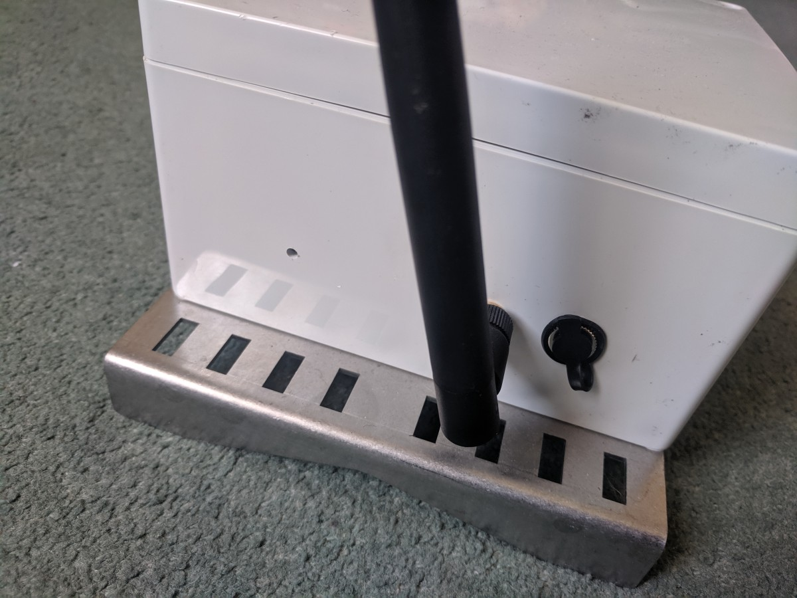

# Setup guide
This is a guide for using the Atmo air quality monitor - Luftdaten enabled. The Arduino firmware that comes pre-installed on the device is included in this repository. If you wish to upload custom code, the onboard ESP8266 can be reprogrammed using a USB-Serial adapter.

## Powering on
The device does not have a power on/off switch, but instead wakes up periodically (by default once every 30 minutes) to perform its duties before going into a low power state. If the device fails to connect to an available WiFi network, the onboard PM sensor will not turn on to preserve battery. The onboard battery gives approximately 1 month of untethered use (i.e. disconnected from the solar panel or mains supply). With the solar panel connected, and providing the device is decently exposed to the sun (At least 2 hours sunlight per day ideally), the device should be able to function indefinitely. If the onboard battery does deplete, it can be recharged using a 9-12V charger with a 2.1mm barrel plug. The charger plugs into the same port as the solar panel.

## Connecting to WiFi
Before installing the device in situ, we recommend connecting it to your WiFi network first. Please ensure the WiFi network you are connecting to is also visible in the location where you intend to install the device, otherwise data will not be uploaded to the Luftdaten network. The steps to connect the device to WiFi are listed below:

