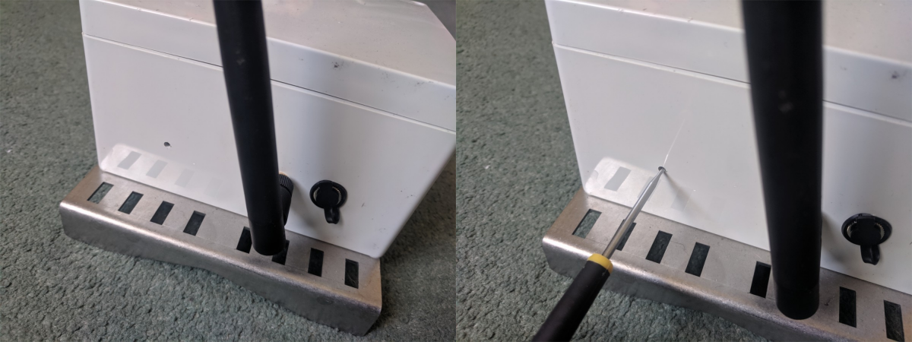
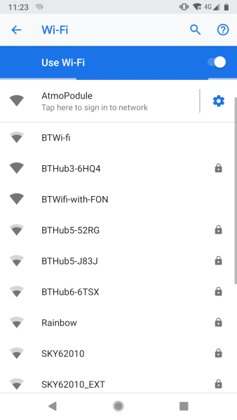
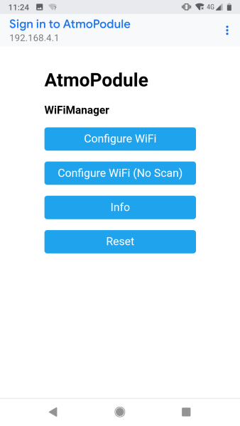
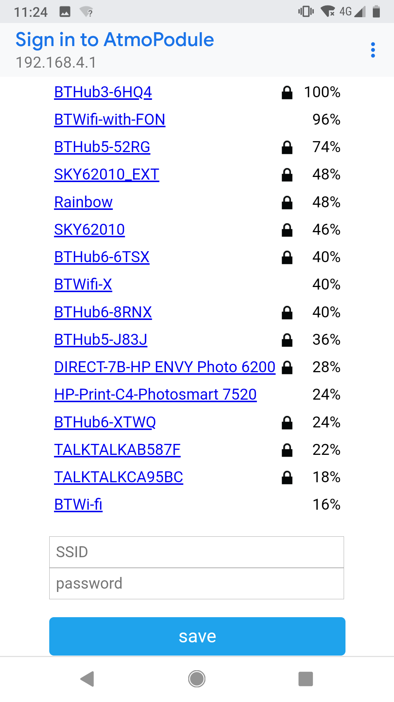

# Setup guide
This is a guide for using the Atmo air quality monitor - Luftdaten enabled. The Arduino firmware that comes pre-installed on the device is included in this repository. If you wish to upload custom code, the onboard ESP8266 can be reprogrammed using a USB-Serial adapter.

## Powering on
The device does not have a power on/off switch, but instead wakes up periodically (by default once every 30 minutes) to perform its duties before going into a low power state. If the device fails to connect to an available WiFi network, the onboard PM sensor will not turn on to preserve battery. The onboard battery gives approximately 1 month of untethered use (i.e. disconnected from the solar panel or mains supply). With the solar panel connected, and providing the device is decently exposed to the sun (At least 2 hours sunlight per day ideally), the device should be able to function indefinitely. If the onboard battery does deplete, it can be recharged using a 9-12V charger with a 2.1mm barrel plug. The charger plugs into the same port as the solar panel.

## Connecting to WiFi
Before installing the device in situ, we recommend connecting it to your WiFi network first. Please ensure the WiFi network you are connecting to is also visible in the location where you intend to install the device, otherwise data will not be uploaded to the Luftdaten network. The steps to connect the device to WiFi are listed below:

- On the bottom side of the device there is a small hole on the left side. Poke something thin like a screwdriver into the hole until you feel a 'click'. The device will now reset and start looking for available WiFi.

- Using a smartphone, search for available WiFi networks. Connect to the network 'AtmoPodule', and tap to sign in.

- On the sign in page, select the first option - Configure WiFi. The device will now perform its own scan for available networks.

- Select your home WiFi network, enter the network password, and click save. The device will now reset and it should connect to your WiFi network. If this is succesful, the WiFi network 'AtmoPodule' should not be visible on your smartphone. If it is visible, then you may have to repeat the last few steps or possibly use a different WiFi network to connect to.

That's it, you are now ready to deploy the device! 

## Deployment

### Wall mounting
The optional wall mounting kit includes 4 wall plugs and screws, to allow mounting on external walls (minimum thickness 40mm). The installation steps are listed below:

- Position the device on the wall and mark the location of the 4 corner holes
- Using a 5mm masonry bit, drill the holes to a depth of 40mm
- Insert the wall plugs into the holes
- Position the device on the wall and install the screws through the corner holes and into the wall plugs using a screwdriver
- Ensure all the screws are tight

### Pole mounting
The optional pole mounting kit includes 2 jubilee clips. The device can be attached to oles with a diameter between 1.5 to 15 inches. The installation steps are listed below:

- Thread the jubilee clips through the upper and lower mounting plates on the device
- Offer the device up to the pole and join the ends of the jubilee clips together
- Tighten the jubilee clips using an 8mm hex socket
